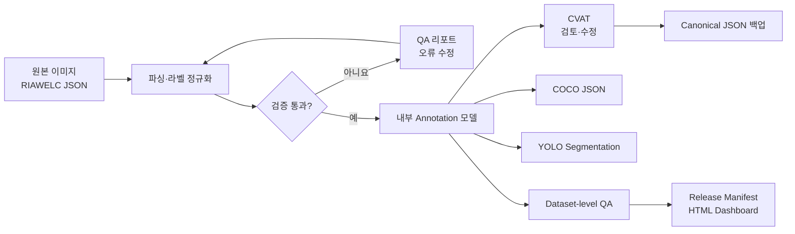

<div align="center">

# 🔥 welding-annotation-qa

### 용접 결함 라벨을 가지런히 정리하는 데이터 QA 도구


> **“모델이 배우기 전에, 라벨부터 가지런히.”**<br>
> 제각각인 용접 결함 Polygon JSON을 검사하고 하나의 표준 이름으로 정리합니다.

</div>

## 프로젝트 소개

RIAWELC 형식의 용접 결함 어노테이션을 읽고, 서로 다르게 적힌 라벨을 하나의 표준 라벨로 정규화합니다.

```text
slag / Slag / 슬래그 → slag_inclusion
기공 / blowhole     → porosity
```

검증을 통과한 데이터는 CVAT 업로드, QA 리포트, COCO JSON, YOLO Segmentation 데이터셋으로 변환할 수 있습니다.

## 주요 기능

| 기능 | 설명 |
|---|---|
| 라벨 정규화 | 영문·한글·별칭을 6개 결함 canonical label로 통합 |
| 데이터 검증 | 필수 필드, 좌표 범위, polygon 구조, 정상 이미지 규칙 검사 |
| CVAT 연동 | Project/Task 생성·재사용, 이미지 업로드, 어노테이션 동기화·내보내기 |
| QA 리포트 | 오류 위치와 원인을 JSON 리포트로 저장 |
| Dataset 검수 | Polygon 충돌·중첩, 이미지 중복, 이미지·JSON 대응 검사 |
| QA 대시보드 | Release Manifest와 로컬 정적 HTML 대시보드 생성 |
| COCO 내보내기 | polygon, bbox, area를 포함한 COCO JSON 생성 |
| YOLO 내보내기 | 정규화된 polygon 좌표와 클래스 파일 생성 |

## 🏷️ Canonical Defect Friends

현재 함께 정리하는 용접 결함 친구들은 총 6종입니다.

| ID | Canonical label | 한글 이름 |
|---:|---|---|
| 0 | `porosity` | 🫧 기공 |
| 1 | `slag_inclusion` | 🪨 슬래그 혼입 |
| 2 | `crack` | ⚡ 균열 |
| 3 | `lack_of_fusion` | 🧩 융합 불량 |
| 4 | `incomplete_penetration` | 🕳️ 용입 부족 |
| 5 | `undercut` | 🌙 언더컷 |

라벨과 alias 설정은 [`configs/taxonomy.yaml`](configs/taxonomy.yaml)에서 관리합니다.
이모지는 결함을 쉽게 구분하기 위한 설명용 표시이며 프로그램의 공식 아이콘은 아닙니다.

> 정상 이미지는 별도 결함 클래스가 아니라 빈 `annotations` 목록으로 표현합니다.

## 빠른 시작

```bash
python -m venv .venv
```

가상환경을 활성화합니다.

```bash
# macOS / Linux
source .venv/bin/activate

# Windows PowerShell
.venv\Scripts\Activate.ps1
```

의존성을 설치하고 테스트합니다.

```bash
python -m pip install -e ".[dev,cvat]"
python -m pytest -q
```

기본 사용 예시:

```python
from pathlib import Path

from welding_qa import TaxonomyConfig, parse_riawelc_json

taxonomy = TaxonomyConfig.load_from_yaml(Path("configs/taxonomy.yaml"))
annotations = parse_riawelc_json(Path("annotation.json"), taxonomy)

for annotation in annotations:
    print(annotation.label_canonical)
```

## 자주 쓰는 명령

```bash
# 전체 데이터 QA 리포트
python -m welding_qa.qa_report --annotations data/annotations --output reports/qa-report.json

# COCO JSON 생성
python -m welding_qa.coco_export --images data/images --annotations data/annotations --output exports/coco/annotations.json

# YOLO Segmentation 데이터셋 생성
python -m welding_qa.yolo_export --images data/images --annotations data/annotations --output-dir exports/yolo

# Phase 3 QA 대시보드와 Release Manifest 생성
python -m welding_qa.release_report --images data/images --annotations data/annotations --output-dir reports/release
```

CVAT 서버 설치와 업로드·동기화 명령은 아래 문서에서 확인할 수 있습니다.

## 문서

| 문서 | 내용 |
|---|---|
| [CVAT 로컬 서버 설정](docs/cvat-setup.md) | Docker 설치, 서버 시작·종료, 계정, 상태 확인, smoke test |
| [어노테이션 작업 흐름](docs/annotation-workflow.md) | 입력 형식, QA, CVAT Project/Task, 동기화와 백업 |
| [COCO·YOLO 내보내기](docs/export-formats.md) | 출력 형식, 클래스 ID, 안전 규칙과 사용 예시 |
| [QA 대시보드와 Release Manifest](docs/qa-dashboard.md) | 충돌·중복 검사, 결과 상태, 대시보드 실행 방법 |
| [프로젝트 계획](docs/project-plan.md) | 단계별 목표와 향후 작업 |

## 데이터 흐름



## 관련 프로젝트

이 저장소는 데이터 준비와 품질 검사를 담당합니다. 모델 학습과 추론은 [WeldVision](https://github.com/hoilycat/WeldVision)에서 진행합니다.

## 현재 상태

- Python 3.10 이상과 Windows·macOS 스크립트 지원
- 테스트 172개 통과
- CVAT Project/Task 생성, 재사용, 동기화, 백업 지원
- COCO 및 YOLO Segmentation 내보내기 지원
- Dataset-level 충돌·중복 검사 및 정적 QA 대시보드 지원

---

<div align="center">

**깨끗한 라벨이 좋은 모델을 만듭니다.** 🧹✨

</div>
